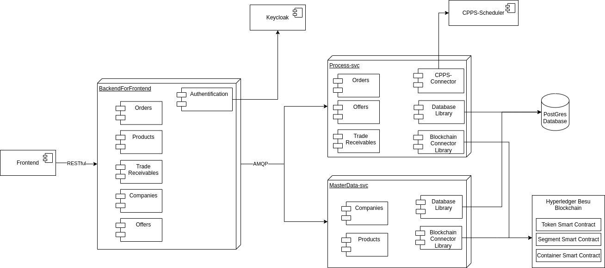
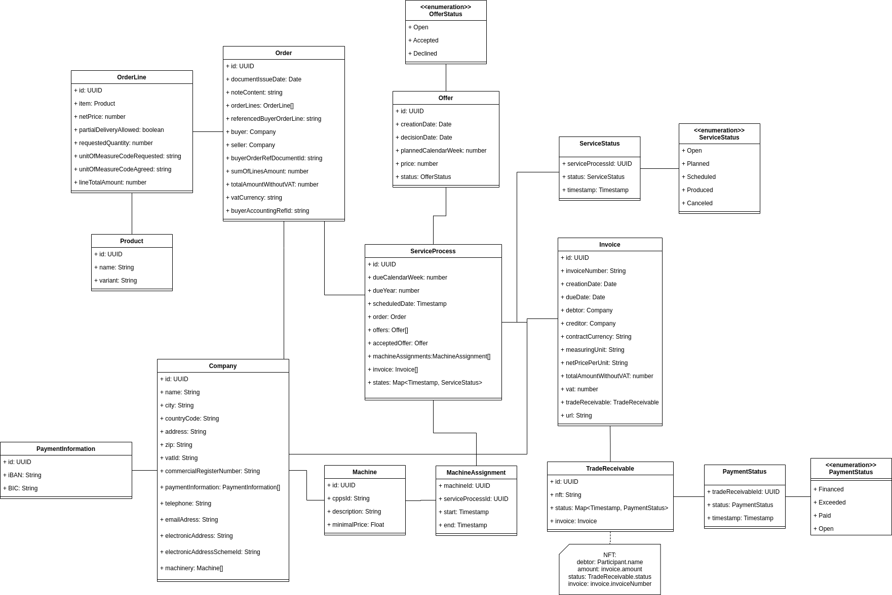

[[chapter-building-block-view]]
:docinfo: shared
:toc: left
:toclevels: 3
:sectnums:
:copyright: Apache License 2.0

= Building Block View

The building block view is a static and hierarchical decomposition of the system into building blocks and their relationships.
It is a collection descriptions for all important components.
Building blocks may be modules, components, subsystems, classes, interfaces, packages, libraries, frameworks, layers, partitions, tiers, functions, macros, operations, data structures, etc.).

For interface specifications, including all method signatures and their descriptions, we refer to the _OpenAPI_ documents.
Only other kinds of interfaces are described here.
This is a simplification of arc42 (which requires a short description of interfaces), to avoid redundancy and inconsistencies, and to reduce documentation efforts.

== Overview

The {projectName} project mainly consists of two parts: a frontend and a backend.
The frontend is a web interface for the user and was developed using Angular.
The backend consists of an backend for frontend, which is responsible for routing requests from the frontend to the corresponding service, and a number of services, which provide the business logic. All three backend applications are implemented using TypeScript and Node.js.
Additionally, the backend utilizes a database, an object storage system, and a blockchain for data storage.

== Building Blocks - Level 1

In level 1, the components of {projectName} are shown.

[cols="1,1,3",options="header"]
|===
| Name
| Status
| Responsibility / Description

| Frontend
| Custom development
| The frontend is the user interface of the project. All actions such as batch creation are carried out from here and all saved data can be viewed.

| Backend for frontend
| Custom development
| The service that receives the interface calls from the frontend and forwards them to the other services.

| Master data service
| Custom development
| The master data service is responsible for managing objects such as companies and products. This includes the creation, fetching and possible updating of these objects.

| Process service
| Custom development
| The process service handles all tasks related to the order and payment process. This includes creating new orders, fetching offers for the orders from the dynamic pricing service, generating invoices according to the ZUGFeRD standard and the corresponding NFTs.

| Message-broker
| Message-broker software
| The service that connects all services from the API service onwards.

| Postgres database
| Relational database management system
| All information is stored non-temporarily here.

| MinIO File Storage
| Object storage system
| Documents such as invoices are stored here.

| Keycloak
| Single sign-on system
| An authorization service with which user logins are implemented and managed.
|===

== Building Blocks - Level 2

In Level 2, the internal components of the above are shown.

=== Frontend

TBD

=== Backend for frontend (BFF)

TBD

=== Process service

TBD

=== Master data service

TBD

== Building Blocks - Level 3

The following section presents the class diagram for {projectName}, providing a comprehensive overview of all classes and their attributes.

